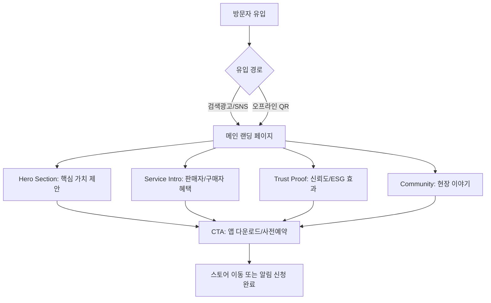

# Surplus Hub 랜딩 페이지 제품 요구사항 정의서 (PRD)

본 문서는 `Surplus Hub`의 성공적인 시장 진입과 사용자 확보를 위한 마케팅 랜딩 페이지의 기획 및 개발 요구사항을 정의합니다.

---

## 1. 기획 배경 및 목표 (Background & Objectives)

### 1.1 기획 배경
- **현황**: `Surplus Hub`는 현재 MVP(Minimum Viable Product) 단계로, 더미 데이터를 실제 데이터로 전환하고 초기 유동성을 확보해야 하는 시점입니다. (출처: `growth-strategy.md`)
- **필요성**:
    - **공급자(Seller)**: 건설 현장의 잉여 자재 처리에 대한 비용 절감 니즈를 자극하고, 간편한 등록 기능을 소구해야 합니다.
    - **수요자(Buyer)**: 저렴한 자재 구매와 직거래의 편의성을 강조하여 앱 설치를 유도해야 합니다.
- **전략적 위치**: '강남/서초' 지역 중심의 하이퍼 로컬 마케팅과 커뮤니티 바이럴의 착륙지(Landing Spot) 역할을 수행합니다.

### 1.2 비즈니스 목표
- **핵심 목표**: 앱 다운로드 및 신규 회원 가입 전환율(CVR) 극대화.
- **세부 목표**:
    - **브랜드 인지**: "건설 현장의 당근마켓"이라는 포지셔닝 전달.
    - **신뢰 형성**: 매너 온도, 안전 결제 등 플랫폼의 신뢰 장치 시각화.
    - **잠재 파트너 확보**: 대형 건설사 및 건재상을 위한 B2B 제휴 문의 채널 확보.

---

## 2. 페이지 구조 및 기능 요구사항 (Structure & Features)

### 2.1 사용자 플로우 (User Flow)

### 2.2 상세 섹션 및 기능 명세

| 섹션 | 구성 요소 | 기능 요구사항 | 비고 |
| :--- | :--- | :--- | :--- |
| **GNB (Header)** | 로고, 메뉴, 다운로드 버튼 | - 스크롤 시 상단 고정 (Sticky) - 모바일: 햄버거 메뉴 적용 | - |
| **1. Hero Section** | 메인 카피, 서브 카피, **CTA 버튼**, 앱 구동 목업 이미지 | - **메인 카피**: "남은 자재, 돈이 됩니다" - **CTA**: [앱 다운로드] (OS 감지하여 스토어 이동) - 배경: 깔끔한 현장 또는 자재 이미지 (밝은 톤) | 핵심 타겟(소장님/인테리어) 공감 유도 |
| **2. Features (Seller)** | "사진 한 장으로 끝내는 재고 처리" | - AI 자동 인식 기능 강조 (GIF/영상 활용) - 비용 절감 효과 계산기 (폐기비용 vs 판매수익 비교) | `RegisterPage`의 간편성 강조 |
| **3. Features (Buyer)** | "새 자재 대비 50% 저렴하게" | - 인기 자재 카테고리 아이콘 나열 - 지역 기반 직거래 매칭 지도 시각화 | - |
| **4. Trust & ESG** | 매너 온도, 거래 후기, 환경 보호 지표 | - 매너 온도 그래픽 애니메이션 - "나무 O그루를 심은 효과" 등 ESG 수치화 | `UserProfile` 신뢰도 시스템 반영 |
| **5. FAQ & Footer** | 자주 묻는 질문, 사업자 정보, SNS 링크 | - 아코디언(Accordion) UI로 FAQ 구성 - B2B 제휴 문의 버튼 포함 | - |

### 2.3 반응형 디자인 요구사항
- **Breakpoint 기준**:
    - **Mobile**: < 768px (1단 레이아웃, 가독성 최우선)
    - **Tablet**: 768px ~ 1024px (2단 그리드, 터치 인터랙션 최적화)
    - **Desktop**: > 1024px (최대 폭 1200px 중앙 정렬, 여백 활용)
- **이미지 최적화**: 디바이스 해상도(DPR)에 따른 `srcset` 적용 (WebP 포맷 권장).

---

## 3. UI/UX 디자인 가이드라인 (Design Guidelines)

본 가이드라인은 `/Users/jeongseongchae/dev/owner/surplus-hub-flutter/docs/01-project-overview.md`에 명시된 앱 디자인 시스템과 일관성을 유지해야 합니다.

### 3.1 톤 앤 매너 (Tone & Manner)
- **키워드**: `Professional` (전문적인), `Trustworthy` (신뢰할 수 있는), `Eco-friendly` (친환경적인).
- **스타일**: 불필요한 장식을 배제한 **Clean & Minimal** 스타일. 건설 현장의 거친 느낌보다는 '스마트한 관리'의 세련된 이미지를 지향합니다.

### 3.2 컬러 시스템 (Color System)
앱의 브랜드 컬러를 웹 환경에 맞춰 적용합니다.

- **Primary**: `#2563EB` (Blue 600) - CTA 버튼, 주요 강조 텍스트, 아이콘.
- **Secondary**: `#F9FAFB` (Gray 50) - 섹션 배경색 (교차 배치하여 구분감 부여).
- **Text**:
    - Heading: `#111827` (Gray 900) - 강한 대비.
    - Body: `#6B7280` (Gray 500) - 가독성 확보.
- **Accent**: `#22C55E` (Green 500) - ESG/친환경 관련 요소 강조 시 제한적 사용.

### 3.3 타이포그래피 (Typography)
- **Font Family**: `Pretendard` (웹 폰트) - 시스템 폰트(San Francisco, Apple SD Gothic Neo)와 유사하며 가독성이 우수함.
- **Scale**:
    - **H1 (Hero)**: Desktop 48px / Mobile 32px (Bold)
    - **H2 (Section)**: Desktop 36px / Mobile 24px (SemiBold)
    - **Body**: Desktop 16px / Mobile 14px (Regular)

### 3.4 인터랙션 (Interaction)
- **Hover**: 버튼 및 링크 호버 시 `Transform: translateY(-2px)` 및 `Box-shadow` 강화.
- **Scroll**: 섹션 진입 시 요소들이 아래에서 위로 부드럽게 나타나는 `Fade-in Up` 애니메이션 적용 (지연 시간차 적용).

---

## 4. 성능 및 기술 요구사항 (Technical Requirements)

### 4.1 성능 목표
- **LCP (Largest Contentful Paint)**: 2.5초 이내 (모바일 네트워크 환경 고려).
- **CLS (Cumulative Layout Shift)**: 0.1 미만 (폰트 로딩 및 이미지 사이즈 최적화 필수).
- **SEO**:
    - 메타 태그 최적화 (Title, Description, OG Tag).
    - 시맨틱 마크업 준수 (`<header>`, `<main>`, `<section>`, `<footer>`).

### 4.2 호환성 및 접근성
- **브라우저 호환성**: Chrome, Safari, Edge, Firefox 최신 버전 (IE 지원 제외).
- **웹 접근성 (A11y)**:
    - 모든 이미지에 `alt` 텍스트 제공.
    - 키보드 네비게이션 지원.
    - 명도 대비 4.5:1 이상 준수.

### 4.3 기술 스택 권장안
- **Framework**: Next.js (SEO 및 SSR 이점) 또는 정적 사이트 생성기(Gatsby/Astro).
- **Hosting**: Vercel 또는 Netlify (CI/CD 자동화).
- **Analytics**: GA4 (Google Analytics 4) 및 GTM (Google Tag Manager) 연동 필수.

---

## 5. 검증 계획 (Verification Plan)

### 5.1 A/B 테스트 케이스
초기 런칭 후 2주간 다음 요소에 대한 A/B 테스트를 진행합니다.

1.  **Hero Copy**:
    - A안: "남은 자재, 돈이 됩니다" (이익 소구)
    - B안: "현장 정리, 이제 스마트폰으로" (편의 소구)
2.  **CTA 버튼 위치**:
    - A안: 상단 고정 바(Sticky Bar) 사용
    - B안: 각 섹션 하단마다 반복 배치

### 5.2 핵심 성과 지표 (KPI)
- **Conversion Rate (CVR)**: 방문자 대비 '앱 다운로드' 버튼 클릭률 (목표: 5% 이상).
- **Bounce Rate (이탈률)**: 50% 미만 유지.
- **Scroll Depth**: 페이지 하단 75% 지점 도달률.

### 5.3 QA 체크리스트
- [ ] 모바일/태블릿/데스크톱 해상도별 레이아웃 깨짐 확인.
- [ ] OS별(iOS/Android) 스토어 링크 연결 정상 작동 확인.
- [ ] 문의하기 폼 제출 및 데이터 수집 확인.
- [ ] GA4 이벤트 트래킹(버튼 클릭) 데이터 적재 확인.

---
*참고 문서:*
- *[성장 전략 보고서](/Users/jeongseongchae/dev/owner/docs/growth-strategy.md)*
- *[프로젝트 개요](/Users/jeongseongchae/dev/owner/surplus-hub-flutter/docs/01-project-overview.md)*
- *[기술 스택](/Users/jeongseongchae/dev/owner/surplus-hub-flutter/docs/02-tech-stack.md)*
