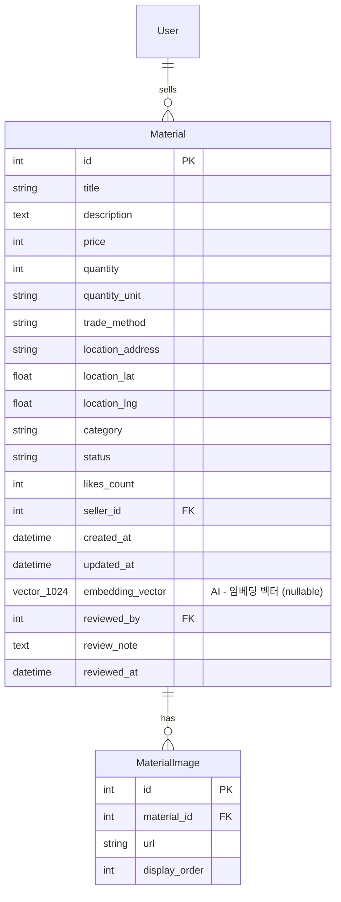

# AI 데이터베이스 변경 사항

Surplus Hub API v3의 AI 통합을 위한 데이터베이스 스키마 변경 문서입니다.

## 1. pgvector 확장 설치

### 확장 활성화
```sql
CREATE EXTENSION IF NOT EXISTS vector;
```

### Docker 이미지
```yaml
# docker-compose.yml
services:
  db:
    image: pgvector/pgvector:pg15  # pgvector가 내장된 PostgreSQL 15 이미지
```

**중요**: `postgres:15` 이미지를 사용하는 경우 pgvector 확장이 포함되지 않으므로, 반드시 `pgvector/pgvector:pg15` 이미지를 사용해야 합니다.

---

## 2. materials 테이블 변경

### 추가된 컬럼

| 컬럼명 | 타입 | Nullable | 설명 |
|--------|------|----------|------|
| `embedding_vector` | `vector(1024)` | YES | 자재 임베딩 벡터 (검색용) |

### 변경 SQL
```sql
ALTER TABLE materials
ADD COLUMN embedding_vector vector(1024);
```

**Nullable 이유**:
- 기존 자재는 임베딩이 없을 수 있음
- 백필(backfill) 작업으로 점진적으로 채움
- 임베딩 생성 실패 시에도 자재 등록은 성공해야 함

---

## 3. HNSW 인덱스

### 인덱스 생성
```sql
CREATE INDEX idx_materials_embedding_hnsw
ON materials USING hnsw (embedding_vector vector_cosine_ops)
WITH (m = 16, ef_construction = 64);
```

### 인덱스 파라미터

| 파라미터 | 값 | 설명 |
|---------|-----|------|
| `m` | 16 | 노드당 연결 수 (높을수록 정확하지만 메모리 증가) |
| `ef_construction` | 64 | 인덱스 빌드 시 탐색 범위 (높을수록 정확하지만 빌드 느림) |

**중소규모 데이터셋 (수천~수만 건) 적합**: 수백만 건 이상의 대규모 데이터셋에서는 파라미터 조정 필요.

### HNSW vs IVFFlat 선택 이유

| 인덱스 타입 | 특징 | Surplus Hub 적합성 |
|-----------|------|------------------|
| **HNSW** | 사전 학습 불필요, 점진적 추가 가능 | ✅ 적합 (자재가 계속 추가됨) |
| **IVFFlat** | CREATE INDEX 전에 데이터 필요, 학습 단계 필요 | ❌ 부적합 (초기 데이터 적음) |

**결론**: 잉여자재 앱은 데이터가 점진적으로 추가되므로 HNSW가 적합합니다.

---

## 4. 마이그레이션

### Migration 파일
- **파일**: `alembic/versions/ai_pgvector_001.py`
- **Revision**: `ai_pgvector_001`
- **Down Revision**: `chat_improve_001`
- **작성일**: 2026-02-21

### Upgrade
```python
def upgrade() -> None:
    # 1. pgvector 확장 활성화
    op.execute("CREATE EXTENSION IF NOT EXISTS vector")

    # 2. embedding_vector 컬럼 추가
    op.execute(
        "ALTER TABLE materials ADD COLUMN embedding_vector vector(1024)"
    )

    # 3. HNSW 인덱스 생성
    op.execute(
        "CREATE INDEX idx_materials_embedding_hnsw "
        "ON materials USING hnsw (embedding_vector vector_cosine_ops) "
        "WITH (m = 16, ef_construction = 64)"
    )
```

### Downgrade (롤백)
```python
def downgrade() -> None:
    # 역순으로 삭제
    op.execute("DROP INDEX IF EXISTS idx_materials_embedding_hnsw")
    op.drop_column('materials', 'embedding_vector')
    op.execute("DROP EXTENSION IF EXISTS vector")
```

### 실행 명령
```bash
# 마이그레이션 적용
alembic upgrade head

# 롤백 (필요 시)
alembic downgrade -1
```

---

## 5. ERD (Entity Relationship Diagram)



**주요 변경점**:
- `embedding_vector` 컬럼 추가 (vector 타입, 1024 차원)
- HNSW 인덱스로 고속 유사도 검색 지원

---

## 6. 쿼리 패턴

### 6.1. 유사 자재 검색 (코사인 유사도)

```python
from sqlalchemy import text

# 쿼리 벡터 준비
query_embedding = embedding_service.encode("H빔 철근")

# 코사인 유사도 검색 (거리 → 유사도 변환)
query = text("""
    SELECT
        id,
        title,
        description,
        price,
        category,
        1 - (embedding_vector <=> :query_vector) as similarity
    FROM materials
    WHERE status = 'ACTIVE'
      AND embedding_vector IS NOT NULL
    ORDER BY embedding_vector <=> :query_vector
    LIMIT 20
""")

results = db.execute(query, {"query_vector": query_embedding.tolist()})
```

**연산자 설명**:
- `<=>`: 코사인 거리 (0에 가까울수록 유사)
- `1 - (distance)`: 유사도로 변환 (1에 가까울수록 유사)

### 6.2. 하이브리드 검색 (키워드 + 벡터)

```python
from sqlalchemy import text, or_, func

# 키워드 검색 점수 계산
keyword_match = or_(
    Material.title.ilike(f"%{keyword}%"),
    Material.description.ilike(f"%{keyword}%")
)

# 벡터 유사도 점수 계산
vector_similarity = func.coalesce(
    1 - Material.embedding_vector.cosine_distance(query_vector),
    0.0
)

# 가중 평균으로 최종 점수 계산
final_score = (
    0.3 * keyword_match +  # 키워드 30%
    0.7 * vector_similarity  # 벡터 70%
)

# 쿼리 실행
materials = (
    db.query(Material)
    .filter(Material.status == "ACTIVE")
    .order_by(final_score.desc())
    .limit(20)
    .all()
)
```

### 6.3. 카테고리 필터링 + 벡터 검색

```python
query = text("""
    SELECT
        id,
        title,
        description,
        price,
        category,
        1 - (embedding_vector <=> :query_vector) as similarity
    FROM materials
    WHERE status = 'ACTIVE'
      AND category = :category
      AND embedding_vector IS NOT NULL
    ORDER BY embedding_vector <=> :query_vector
    LIMIT 20
""")

results = db.execute(
    query,
    {
        "query_vector": query_embedding.tolist(),
        "category": "철근"
    }
)
```

---

## 7. 인덱스 성능 분석

### 인덱스 크기 확인
```sql
SELECT
    schemaname,
    tablename,
    indexname,
    pg_size_pretty(pg_relation_size(indexrelid)) AS index_size
FROM pg_stat_user_indexes
WHERE indexname = 'idx_materials_embedding_hnsw';
```

### 검색 성능 확인
```sql
EXPLAIN ANALYZE
SELECT id, title, 1 - (embedding_vector <=> '[0.1, 0.2, ...]'::vector) as similarity
FROM materials
WHERE status = 'ACTIVE'
  AND embedding_vector IS NOT NULL
ORDER BY embedding_vector <=> '[0.1, 0.2, ...]'::vector
LIMIT 20;
```

**기대 성능** (10,000건 기준):
- HNSW 인덱스 사용: ~10-50ms
- Full scan: ~500-1000ms

---

## 8. 임베딩 백필 (Backfill)

기존 자재에 대한 임베딩 생성 스크립트:

```python
# scripts/backfill_embeddings.py
from app.db.session import SessionLocal
from app.models.material import Material
from app.ai.services.embeddings import EmbeddingService

def backfill_embeddings():
    db = SessionLocal()
    embedding_service = EmbeddingService()

    # 임베딩이 없는 자재만 조회
    materials = (
        db.query(Material)
        .filter(Material.embedding_vector.is_(None))
        .filter(Material.status == "ACTIVE")
        .all()
    )

    print(f"총 {len(materials)}개 자재 임베딩 생성 시작...")

    for i, material in enumerate(materials):
        try:
            # 제목 + 설명으로 임베딩 생성
            text = f"{material.title} {material.description}"
            embedding = embedding_service.encode(text)

            # DB에 저장
            material.embedding_vector = embedding.tolist()
            db.commit()

            if (i + 1) % 100 == 0:
                print(f"진행: {i + 1}/{len(materials)}")

        except Exception as e:
            print(f"자재 ID {material.id} 임베딩 생성 실패: {e}")
            db.rollback()

    print("임베딩 백필 완료!")
    db.close()

if __name__ == "__main__":
    backfill_embeddings()
```

### 실행 방법
```bash
cd /path/to/surplus-hub-api-v3
python scripts/backfill_embeddings.py
```

---

## 9. 임베딩 비율 모니터링

### 임베딩 생성 비율 확인
```sql
SELECT
    COUNT(*) FILTER (WHERE embedding_vector IS NOT NULL) AS with_embedding,
    COUNT(*) FILTER (WHERE embedding_vector IS NULL) AS without_embedding,
    COUNT(*) AS total,
    ROUND(
        COUNT(*) FILTER (WHERE embedding_vector IS NOT NULL) * 100.0 / COUNT(*),
        2
    ) AS embedding_percentage
FROM materials
WHERE status = 'ACTIVE';
```

**목표**: 활성 자재의 95% 이상이 임베딩을 가져야 함.

---

## 10. 주의사항 및 제약

### 10.1. NULL 처리
- 임베딩이 NULL인 자재는 벡터 검색 결과에 포함되지 않음
- 검색 쿼리에 `embedding_vector IS NOT NULL` 조건 필수

### 10.2. 차원 불일치 에러
```sql
-- ❌ 잘못된 차원
INSERT INTO materials (title, embedding_vector)
VALUES ('H빔', '[0.1, 0.2, 0.3]');  -- 에러: 1024 차원이어야 함

-- ✅ 올바른 차원
INSERT INTO materials (title, embedding_vector)
VALUES ('H빔', '[0.1, 0.2, ..., (1024개)]');
```

### 10.3. 인덱스 재구성
대량의 데이터 변경 후 인덱스 성능 저하 시:

```sql
REINDEX INDEX idx_materials_embedding_hnsw;
```

### 10.4. 백업 시 주의
- pgvector 확장이 설치된 PostgreSQL에서만 복원 가능
- 백업 파일에 `CREATE EXTENSION vector` 포함 확인

---

## 11. 성능 튜닝

### 11.1. HNSW 파라미터 조정

**데이터 규모별 권장 설정**:

| 자재 수 | m | ef_construction | 예상 인덱스 크기 |
|--------|-----|----------------|---------------|
| < 10,000 | 16 | 64 | ~40MB |
| 10,000 - 100,000 | 24 | 128 | ~500MB |
| 100,000 - 1,000,000 | 32 | 200 | ~5GB |

### 11.2. PostgreSQL 설정

```conf
# postgresql.conf
shared_buffers = 512MB  # 전체 메모리의 25%
work_mem = 16MB  # 벡터 정렬 시 사용
maintenance_work_mem = 256MB  # 인덱스 빌드 시 사용
```

---

*Last Updated: 2026-02-21*
