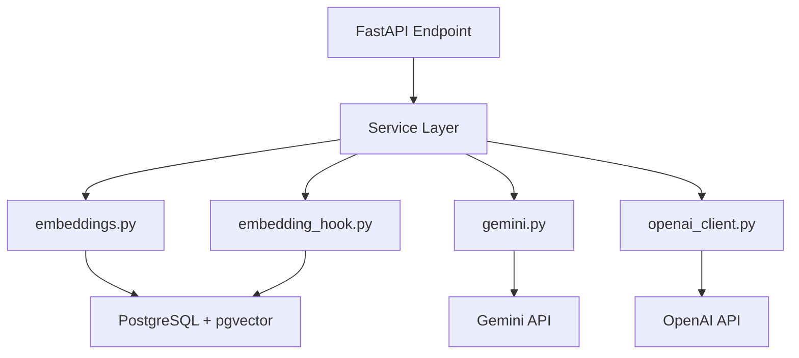

# AI 기능 인수인계 문서

Surplus Hub API v3 (건설 잉여자재 마켓플레이스)의 AI 기능 통합에 대한 포괄적 개발자 인수인계 문서입니다.

**작성일**: 2026-02-21
**버전**: 1.0
**프로젝트**: Surplus Hub API v3

---

## 목차

1. [개요](#1-개요)
2. [시스템 아키텍처](#2-시스템-아키텍처)
3. [Phase별 상세 설명](#3-phase별-상세-설명)
4. [파일 매니페스트](#4-파일-매니페스트)
5. [테스트 전략](#5-테스트-전략)
6. [설정 및 환경변수](#6-설정-및-환경변수)
7. [관련 문서 링크](#7-관련-문서-링크)
8. [주의사항 및 알려진 이슈](#8-주의사항-및-알려진-이슈)

---

## 1. 개요

### AI 기능 통합 목적

건설 잉여자재 마켓플레이스의 사용자 경험(UX)을 획기적으로 향상시키기 위해 AI 기능을 통합했습니다.

**핵심 가치 제안**:
- **검색 정확도 향상**: 키워드 검색의 한계를 극복하는 시맨틱 검색
- **등록 편의성**: 이미지만으로 자재 정보 자동 생성
- **거래 효율화**: AI 기반 채팅 답장 제안 및 커뮤니티 QA

### 3단계 구현 로드맵

| Phase | 기능 | 상태 | 완료일 |
|-------|------|------|--------|
| **Phase 1** | 시맨틱 검색 (Hybrid Search) | ✅ 완료 | 2026-02-21 |
| **Phase 2** | 스마트 자재 등록 (Vision AI + LLM) | ✅ 완료 | 2026-02-21 |
| **Phase 3** | 스마트 채팅 + 커뮤니티 QA | ✅ 완료 | 2026-02-21 |

### 기술 스택 요약

| 구성 요소 | 기술 | 버전 | 용도 |
|----------|------|------|------|
| **Embedding 모델** | BAAI/bge-m3 | - | 텍스트→벡터 변환 (로컬) |
| **Vision AI** | Gemini 2.5 Flash-Lite | - | 이미지 분석 |
| **Text Generation** | GPT-5 Nano/Mini | - | 설명 생성, QA |
| **Vector DB** | PostgreSQL + pgvector | 0.3+ | 벡터 검색 |
| **Framework** | FastAPI | 0.115+ | API 서버 |

**총 코드량**: 약 810줄 (AI 모듈 전체)

---

## 2. 시스템 아키텍처

### 데이터 흐름도

```
Client → FastAPI Router (ai_assist.py)
           ├── GET /ai/search → search.py → embeddings.py → pgvector
           ├── POST /ai/analyze-image → registration.py → gemini.py → Gemini API
           ├── POST /ai/generate-description → registration.py → openai_client.py → OpenAI API
           ├── POST /ai/suggest-price → registration.py → search.py + openai_client.py
           ├── POST /ai/chat-suggestions → qa_bot.py → openai_client.py → OpenAI API
           ├── POST /ai/community-answer → qa_bot.py → openai_client.py → OpenAI API
           └── POST /ai/summarize-discussion → qa_bot.py → openai_client.py → OpenAI API
```

### 디렉토리 구조

```
app/ai/
├── __init__.py                 # 모듈 초기화
├── clients/                    # 외부 AI 서비스 클라이언트
│   ├── __init__.py
│   ├── embeddings.py           # bge-m3 싱글톤 로더 (Thread-safe)
│   ├── gemini.py               # Gemini 2.5 Flash-Lite 클라이언트 (싱글톤)
│   └── openai_client.py        # GPT-5 Nano/Mini 클라이언트 (싱글톤)
├── prompts/                    # LLM 프롬프트 템플릿
│   ├── __init__.py
│   ├── material.py             # 이미지 분석, 설명 생성, 가격 제안 프롬프트
│   └── chat_qa.py              # 채팅 답장, QA, 요약 프롬프트
└── services/                   # 비즈니스 로직 서비스
    ├── __init__.py
    ├── search.py               # 하이브리드 검색 (키워드 + 벡터)
    ├── registration.py         # Vision + LLM 파이프라인
    ├── embedding_hook.py       # 자재 생성/수정 시 자동 임베딩
    └── qa_bot.py               # 채팅/커뮤니티 QA/요약
```

### 컴포넌트 상호작용



### 레이어별 책임

| 레이어 | 구성 요소 | 책임 |
|--------|----------|------|
| **API Layer** | `app/api/endpoints/ai_assist.py` | 요청 검증, 응답 포맷팅, Rate Limiting |
| **Service Layer** | `app/ai/services/*.py` | 비즈니스 로직, AI 파이프라인 오케스트레이션 |
| **Client Layer** | `app/ai/clients/*.py` | 외부 API 호출, 싱글톤 패턴, 에러 핸들링 |
| **Prompt Layer** | `app/ai/prompts/*.py` | LLM 프롬프트 관리 |
| **Data Layer** | PostgreSQL + pgvector | 벡터 저장, 유사도 검색 |

---

## 3. Phase별 상세 설명

### Phase 1: 시맨틱 검색

#### 개요
키워드 검색(30%)과 벡터 유사도 검색(70%)을 결합한 하이브리드 검색 시스템.

#### 핵심 파일

**1. `app/ai/clients/embeddings.py`**

Thread-safe 싱글톤 패턴으로 bge-m3 모델을 로딩합니다.

```python
# 주요 함수
def _get_model():
    """Double-check locking으로 모델 싱글톤 생성"""
    # 전역 _lock 사용, 멀티스레드 안전

def build_search_text(title: str, description: str, category: str) -> str:
    """자재 필드를 검색용 텍스트로 결합"""
    # 형식: "{title} 카테고리: {category} {description[:500]}"

def generate_embedding(text: str) -> List[float]:
    """단일 텍스트의 임베딩 생성 (1024차원)"""
    # normalize_embeddings=True → 코사인 유사도 최적화

def generate_embeddings_batch(texts: List[str], batch_size: int = 32) -> List[List[float]]:
    """여러 텍스트의 임베딩을 배치로 생성 (효율적)"""
```

**2. `app/ai/services/search.py`**

하이브리드 검색 로직을 구현합니다.

```python
# 주요 함수
def hybrid_search(db: Session, query: str, page: int, limit: int, category: str) -> (List[dict], int):
    """키워드(30%) + 벡터(70%) 가중 평균으로 최종 점수 계산"""
    # 반환: (results, total_count)
    # 각 result: {"material": Material, "score": float, "vector_similarity": float, "keyword_score": float}

def vector_search_only(db: Session, query: str, limit: int) -> List[Tuple[Material, float]]:
    """순수 벡터 유사도 검색 (가격 제안용)"""

def find_similar_materials(db: Session, material_id: int, limit: int) -> List[Tuple[Material, float]]:
    """특정 자재와 유사한 자재 검색"""
```

**검색 파라미터**:
- `KEYWORD_WEIGHT = 0.3`: 키워드 매칭 가중치
- `VECTOR_WEIGHT = 0.7`: 벡터 유사도 가중치
- `MIN_SIMILARITY = 0.3`: 최소 유사도 임계값 (30% 이하는 제외)

**3. `app/ai/services/embedding_hook.py`**

자재 생성/수정 시 자동으로 임베딩을 생성합니다.

```python
def update_material_embedding(db: Session, material: Material) -> bool:
    """자재 임베딩 생성 후 DB 저장. 실패 시 rollback 후 False 반환"""
    # try/except로 감싸서 메인 플로우를 절대 방해하지 않음
    # 실패 로그 기록 후 계속 진행
```

**호출 위치**:
- `app/api/endpoints/materials.py`: 자재 생성 후
- `app/api/endpoints/materials.py`: 자재 수정 후

#### pgvector HNSW 인덱스

**인덱스 정의**:
```sql
CREATE INDEX idx_materials_embedding_hnsw
ON materials USING hnsw (embedding_vector vector_cosine_ops)
WITH (m = 16, ef_construction = 64);
```

**파라미터 설명**:
- `m = 16`: 노드당 연결 수 (높을수록 정확하지만 메모리↑)
- `ef_construction = 64`: 인덱스 빌드 시 탐색 범위 (높을수록 정확하지만 빌드 느림)

**선택 이유**: 중소규모 데이터셋(수천~수만 건)에 최적, 점진적 데이터 추가에 적합

---

### Phase 2: 스마트 자재 등록

#### 개요
이미지 업로드 → Vision AI 분석 → LLM 설명 생성 → 가격 제안의 파이프라인.

#### 핵심 파일

**1. `app/ai/clients/gemini.py`**

Gemini 2.5 Flash-Lite를 사용한 이미지 분석.

```python
MODEL_NAME = "gemini-2.5-flash-lite"

def _get_client():
    """Thread-safe 싱글톤으로 genai.Client 생성"""

def analyze_image(image_url: str, categories: Optional[list]) -> dict:
    """이미지 URL을 분석하여 JSON 반환

    반환 값:
    {
        "category": "철근",
        "tags": ["H빔", "구조용", "건설"],
        "title_suggestion": "H빔 잉여자재",
        "condition": "양호",
        "material_type": "H빔",
        "confidence": 0.92
    }
    """
```

**프롬프트**: `app/ai/prompts/material.py::IMAGE_ANALYSIS_PROMPT`
- 건설 잉여자재 전문 분석가 페르소나
- JSON 형식 강제
- 상태 판단 기준: 표면 상태, 녹, 변색, 파손

**2. `app/ai/clients/openai_client.py`**

GPT-5 Nano/Mini를 사용한 텍스트 생성.

```python
DEFAULT_MODEL = "gpt-5-nano"
REASONING_MODEL = "gpt-5-mini"

def generate_text(system_prompt: str, user_prompt: str, model: str, max_tokens: int, temperature: float) -> str:
    """단일 사용자 메시지로 텍스트 생성"""

def generate_text_with_history(system_prompt: str, messages: List[dict], model: str, max_tokens: int, temperature: float) -> str:
    """대화 히스토리를 포함한 텍스트 생성 (채팅 답장용)"""
```

**모델 선택 기준** (`qa_bot.py` 예시):
```python
def select_model(post_content: str, category: str) -> str:
    if category == "Safety":  # 안전 관련은 정확성 중요
        return "gpt-5-mini"
    if len(post_content) > 500:  # 긴 내용은 복잡한 추론 필요
        return "gpt-5-mini"
    return "gpt-5-nano"  # 그 외는 비용 절감
```

**3. `app/ai/services/registration.py`**

Vision AI + LLM 파이프라인을 조율합니다.

```python
def analyze_material_image(image_url: str) -> ImageAnalysisResponse:
    """Gemini로 이미지 분석 후 Pydantic 모델로 반환"""

def generate_material_description(
    title: str, tags: List[str], category: str, condition: str, quantity: int, quantity_unit: str
) -> DescriptionGenerateResponse:
    """자재 정보를 기반으로 LLM이 설명 자동 생성 (2-3문장)"""

def suggest_material_price(
    db: Session, title: str, category: str, condition: str, quantity: int
) -> PriceSuggestResponse:
    """유사 자재를 벡터 검색한 후 LLM이 가격 제안"""
    # 1. vector_search_only()로 유사 매물 10개 검색
    # 2. 유사 매물 정보를 프롬프트에 포함
    # 3. LLM이 JSON 형식으로 가격 범위 제안
    # {"suggested_price": 120000, "price_range_low": 100000, "price_range_high": 150000, "reasoning": "..."}
```

#### 프롬프트 상세

**`DESCRIPTION_GENERATION_PROMPT`**:
- 200자 내외, 간결하고 매력적
- 자재 특성, 상태, 활용 가능성 포함
- 과장 없이 사실 기반

**`PRICE_SUGGESTION_PROMPT`**:
- 유사 매물 평균 ±20% 범위
- 상태에 따라 조정 (양호→상향, 손상→하향)
- 잉여자재 할인율 반영 (보통 30~60%)

---

### Phase 3: 스마트 채팅 + 커뮤니티 QA

#### 개요
채팅방에서 빠른 답장 제안, 커뮤니티 질문 자동 답변, 토론 요약.

#### 핵심 파일

**`app/ai/services/qa_bot.py`**

```python
def generate_chat_suggestions(db: Session, room_id: int, current_user_id: int) -> ChatSuggestionResponse:
    """채팅방의 최근 10개 메시지를 분석하여 빠른 답장 3개 제안"""
    # 1. 최근 메시지 조회 (역순 → 정순 변환)
    # 2. buyer/seller 구분 (role: "user" vs "assistant")
    # 3. 자재 정보 컨텍스트 추가
    # 4. LLM이 JSON 배열로 답장 3개 생성
    # 반환: {"suggestions": ["확인했습니다.", "가격 조정 가능한가요?", "직거래 원합니다."]}

def generate_community_answer(db: Session, post_id: int) -> CommunityAnswerResponse:
    """커뮤니티 게시글에 AI 답변 생성"""
    # 1. 게시글 조회
    # 2. 모델 선택 (Safety 카테고리 또는 500자 이상 → Mini)
    # 3. 전문가 페르소나로 200~300자 답변 생성
    # 반환: {"answer": "...", "modelUsed": "gpt-5-nano"}

def summarize_discussion(db: Session, post_id: int) -> SummarizeResponse:
    """게시글 + 댓글(최대 100개)을 요약"""
    # 1. 게시글 + 댓글 100개까지 조회
    # 2. 댓글이 5개 미만이면 요약 불필요 (조기 종료 가능)
    # 3. LLM이 JSON 형식으로 요약 + 핵심 포인트 3-5개 반환
    # 반환: {"summary": "...", "keyPoints": ["포인트1", "포인트2", "포인트3"]}
```

#### 프롬프트 상세

**`CHAT_SUGGESTION_PROMPT`**:
- 30자 이내, 자연스럽고 예의바른 답장
- 거래에 실질적 도움 (가격 협상, 상태 확인, 거래 일정)
- JSON 배열로 강제 반환

**`COMMUNITY_ANSWER_PROMPT`**:
- 건설 현장 안전 및 자재 전문가 페르소나
- 안전 관련은 규정/기준 언급
- 불확실한 정보는 "전문가 확인 필요"로 명시

**`SUMMARIZE_DISCUSSION_PROMPT`**:
- 객관적이고 중립적 요약
- 핵심 포인트 3-5개
- JSON 강제 반환 (`{"summary": "...", "key_points": [...]}`)

---

## 4. 파일 매니페스트

### 신규 파일 (19개)

#### AI 모듈 (13개)

| 파일 | 줄 수 | 역할 |
|------|------|------|
| `app/ai/__init__.py` | 5 | 모듈 초기화 |
| `app/ai/clients/__init__.py` | 5 | 클라이언트 패키지 |
| `app/ai/clients/embeddings.py` | 56 | bge-m3 임베딩 생성 (싱글톤) |
| `app/ai/clients/gemini.py` | 79 | Gemini 2.5 Flash-Lite 이미지 분석 |
| `app/ai/clients/openai_client.py` | 79 | GPT-5 Nano/Mini 텍스트 생성 |
| `app/ai/prompts/__init__.py` | 5 | 프롬프트 패키지 |
| `app/ai/prompts/material.py` | 54 | 자재 관련 프롬프트 3개 |
| `app/ai/prompts/chat_qa.py` | 42 | 채팅/QA 프롬프트 3개 |
| `app/ai/services/__init__.py` | 5 | 서비스 패키지 |
| `app/ai/services/search.py` | 151 | 하이브리드 검색 로직 |
| `app/ai/services/registration.py` | 138 | Vision + LLM 파이프라인 |
| `app/ai/services/embedding_hook.py` | 35 | 자재 임베딩 자동 생성 |
| `app/ai/services/qa_bot.py` | 185 | 채팅/커뮤니티 QA/요약 |

**소계**: 약 839줄

#### API 엔드포인트 (1개)

| 파일 | 줄 수 | 역할 |
|------|------|------|
| `app/api/endpoints/ai_assist.py` | 255 | 7개 AI 엔드포인트 라우터 |

#### 스키마 (1개)

| 파일 | 줄 수 | 역할 |
|------|------|------|
| `app/schemas/ai_schemas.py` | ~120 | 요청/응답 Pydantic 모델 (추정) |

#### 테스트 (2개)

| 파일 | 줄 수 | 역할 |
|------|------|------|
| `app/tests/api/test_ai_search.py` | ~80 | 하이브리드 검색 테스트 5개 |
| `app/tests/api/test_ai_assist.py` | ~200 | 6개 엔드포인트 테스트 13개 |

#### 문서 (3개)

| 파일 | 역할 |
|------|------|
| `docs/ai/TECH_STACK.md` | AI 기술 스택 상세 문서 |
| `docs/ai/DATABASE.md` | pgvector 마이그레이션 및 쿼리 패턴 |
| `docs/ai/API_SUMMARY.md` | 7개 AI 엔드포인트 API 명세 |

### 수정 파일 (5개)

| 파일 | 변경 내용 |
|------|----------|
| `app/models/material.py` | `embedding_vector: Vector(1024)` 컬럼 추가 (conditional import) |
| `app/api/endpoints/materials.py` | 자재 생성/수정 후 `update_material_embedding()` 호출 추가 |
| `app/core/config.py` | `GOOGLE_AI_API_KEY`, `OPENAI_API_KEY`, `EMBEDDING_MODEL_NAME`, `EMBEDDING_DIMENSION` 추가 (추정) |
| `alembic/versions/ai_pgvector_001.py` | pgvector 확장 + 컬럼 추가 + HNSW 인덱스 마이그레이션 |
| `requirements.txt` | `sentence-transformers`, `google-genai`, `openai`, `pgvector` 추가 |

---

## 5. 테스트 전략

### SQLite 제약 및 Mock 전략

**문제**: 테스트 DB는 SQLite를 사용하지만, pgvector는 PostgreSQL 전용 확장.

**해결**: 서비스 레이어를 Mock 처리.

```python
# test_ai_search.py 예시
@patch("app.ai.services.search.hybrid_search")
def test_search_returns_results_with_scores(mock_search, client: TestClient):
    mock_material = MagicMock()
    mock_material.id = 1
    mock_material.title = "H빔 잉여"
    # ...

    mock_search.return_value = (
        [{"material": mock_material, "score": 0.85, "vector_similarity": 0.92, "keyword_score": 0.7}],
        1
    )

    response = client.get("/api/v1/ai/search?q=H빔")
    assert response.status_code == 200
    assert response.json()["data"][0]["score"] == 0.85
```

### 테스트 파일 구조

#### `test_ai_search.py` (5개 테스트)

```python
class TestSemanticSearch:
    def test_search_missing_query_returns_422(...)  # 쿼리 파라미터 누락
    def test_search_returns_empty_results(...)      # 결과 없을 때
    def test_search_returns_results_with_scores(...) # 점수 포함 결과
    def test_search_with_pagination(...)            # 페이지네이션
    def test_search_with_category_filter(...)       # 카테고리 필터
```

#### `test_ai_assist.py` (13개 테스트)

```python
class TestAnalyzeImage:
    def test_analyze_image_without_auth_returns_401(...)
    def test_analyze_image_success(...)
    def test_analyze_image_service_error_returns_502(...)

class TestGenerateDescription:
    def test_generate_description_without_auth_returns_401(...)
    def test_generate_description_success(...)
    def test_generate_description_service_error_returns_502(...)

class TestSuggestPrice:
    def test_suggest_price_without_auth_returns_401(...)
    def test_suggest_price_success(...)
    def test_suggest_price_service_error_returns_502(...)

class TestChatSuggestions:
    def test_chat_suggestions_without_auth_returns_401(...)
    def test_chat_suggestions_success(...)

class TestCommunityAnswer:
    def test_community_answer_success(...)

class TestSummarizeDiscussion:
    def test_summarize_discussion_success(...)
```

### Mock 패턴

**서비스 레이어 Mock**:
```python
@patch("app.ai.services.search.hybrid_search")
@patch("app.ai.services.registration.analyze_material_image")
@patch("app.ai.services.qa_bot.generate_chat_suggestions")
```

**Pydantic 응답 Mock**:
```python
mock_analyze.return_value = ImageAnalysisResponse(
    category="철근",
    tags=["H빔", "구조용", "건설"],
    titleSuggestion="H빔 잉여자재",
    condition="양호",
    materialType="H빔",
    confidence=0.92,
)
```

### 테스트 실행 명령

```bash
# 전체 AI 테스트 실행
pytest app/tests/api/test_ai_*.py -v

# 특정 테스트 클래스
pytest app/tests/api/test_ai_assist.py::TestAnalyzeImage -v

# 커버리지 확인
pytest app/tests/api/test_ai_*.py --cov=app/ai --cov-report=html
```

---

## 6. 설정 및 환경변수

### 필수 환경변수

| 변수명 | 필수 | 기본값 | 설명 |
|--------|------|--------|------|
| `GOOGLE_AI_API_KEY` | ✅ | - | Gemini API 인증 키 |
| `OPENAI_API_KEY` | ✅ | - | OpenAI API 인증 키 |
| `EMBEDDING_MODEL_NAME` | - | `BAAI/bge-m3` | 사용할 임베딩 모델명 |
| `EMBEDDING_DIMENSION` | - | `1024` | 임베딩 벡터 차원 |

### config.py 설정 예시

```python
# app/core/config.py (추정)

class Settings(BaseSettings):
    # ... 기존 설정 ...

    # AI API Keys
    GOOGLE_AI_API_KEY: str = Field(..., env="GOOGLE_AI_API_KEY")
    OPENAI_API_KEY: str = Field(..., env="OPENAI_API_KEY")

    # Embedding Settings
    EMBEDDING_MODEL_NAME: str = Field(default="BAAI/bge-m3")
    EMBEDDING_DIMENSION: int = Field(default=1024)

    class Config:
        env_file = ".env"
```

### .env 파일 예시

```bash
# AI API Keys
GOOGLE_AI_API_KEY=AIzaSy...
OPENAI_API_KEY=sk-proj-...

# Optional: 다른 임베딩 모델 사용 시
# EMBEDDING_MODEL_NAME=intfloat/multilingual-e5-large
# EMBEDDING_DIMENSION=1024
```

### PostgreSQL 설정

**docker-compose.yml**:
```yaml
services:
  db:
    image: pgvector/pgvector:pg15  # pgvector 내장 이미지 필수
    environment:
      POSTGRES_DB: surplus_hub
      POSTGRES_USER: postgres
      POSTGRES_PASSWORD: password
    ports:
      - "5432:5432"
    volumes:
      - postgres_data:/var/lib/postgresql/data
```

**postgresql.conf 권장 설정** (성능 최적화):
```conf
shared_buffers = 512MB        # 전체 메모리의 25%
work_mem = 16MB               # 벡터 정렬 시 사용
maintenance_work_mem = 256MB  # 인덱스 빌드 시 사용
```

### 마이그레이션 적용

```bash
# pgvector 확장 + 컬럼 추가 + 인덱스 생성
alembic upgrade head

# 확인
psql -U postgres -d surplus_hub -c "\dx"  # pgvector 확장 확인
psql -U postgres -d surplus_hub -c "\d materials"  # embedding_vector 컬럼 확인
psql -U postgres -d surplus_hub -c "\di"  # idx_materials_embedding_hnsw 인덱스 확인
```

---

## 7. 관련 문서 링크

### 내부 문서

| 문서 | 경로 | 설명 |
|------|------|------|
| **기술 스택** | [TECH_STACK.md](./TECH_STACK.md) | bge-m3, Gemini, GPT-5, pgvector 상세 |
| **데이터베이스** | [DATABASE.md](./DATABASE.md) | pgvector 마이그레이션, 쿼리 패턴, HNSW 인덱스 |
| **API 명세** | [API_SUMMARY.md](./API_SUMMARY.md) | 7개 엔드포인트 상세 스펙 |

### 프로젝트 전체 문서 (docs/ 디렉토리)

상위 디렉토리의 다음 문서들도 참고하세요:

- **`docs/ARCHITECTURE.md`**: 전체 시스템 아키텍처
- **`docs/DATABASE_SCHEMA.md`**: ERD 및 테이블 정의
- **`docs/API_ENDPOINTS.md`**: 전체 55개 API 엔드포인트 목록
- **`docs/DEPLOYMENT.md`**: 배포 가이드 (Docker, Gunicorn)

### 외부 문서

| 리소스 | URL | 용도 |
|--------|-----|------|
| **bge-m3** | [HuggingFace](https://huggingface.co/BAAI/bge-m3) | 임베딩 모델 문서 |
| **Gemini API** | [Google AI Docs](https://ai.google.dev/gemini-api/docs) | Vision AI 가이드 |
| **OpenAI API** | [OpenAI Platform](https://platform.openai.com/docs/api-reference) | GPT-5 API 레퍼런스 |
| **pgvector** | [GitHub](https://github.com/pgvector/pgvector) | PostgreSQL 벡터 확장 |
| **HNSW 알고리즘** | [arXiv](https://arxiv.org/abs/1603.09320) | Approximate Nearest Neighbor 논문 |

---

## 8. 주의사항 및 알려진 이슈

### 메모리 사용량

#### bge-m3 모델

**메모리 소비**: 약 2.4GB (모델 로딩 시)

**최적화 전략**:
- ✅ 싱글톤 패턴으로 1개 인스턴스만 로딩
- ✅ Gunicorn `--preload` 옵션으로 워커 간 모델 공유
- ✅ Lazy Loading (첫 호출 시에만 로딩)

**권장 서버 스펙**: 최소 4GB RAM (모델 + FastAPI + PostgreSQL)

### pgvector 조건부 Import

#### 문제
테스트 환경(SQLite)에서는 pgvector를 사용할 수 없어 import 에러 발생.

#### 해결책

`app/models/material.py`:
```python
try:
    from pgvector.sqlalchemy import Vector
except ImportError:
    Vector = None

class Material(Base):
    __tablename__ = "materials"

    # ... 기존 컬럼 ...

    if Vector is not None:
        embedding_vector = Column(Vector(1024), nullable=True)
    else:
        embedding_vector = Column(Text, nullable=True)  # 테스트용 fallback
```

### 외부 API 에러 핸들링

#### 모든 AI 서비스 호출은 try/except로 감싸기

**API 엔드포인트 패턴** (`ai_assist.py`):
```python
@router.post("/analyze-image")
def analyze_image(...):
    try:
        result = registration_service.analyze_material_image(body.image_url)
    except Exception:
        raise HTTPException(status_code=502, detail="Vision AI service unavailable")

    return {"status": "success", "data": result.model_dump(by_alias=True)}
```

**서비스 레이어 패턴** (`embedding_hook.py`):
```python
def update_material_embedding(db: Session, material: Material) -> bool:
    try:
        embedding = generate_embedding(search_text)
        material.embedding_vector = embedding
        db.commit()
        return True
    except Exception:
        logger.exception("Failed to update embedding for material %d", material.id)
        db.rollback()
        return False
```

**원칙**: 외부 API 장애가 메인 플로우를 절대 방해하지 않도록.

### Rate Limiting

#### slowapi 사용

엔드포인트별 분당 호출 제한:

| 엔드포인트 | 제한 | 이유 |
|-----------|------|------|
| `/ai/search` | 30/분 | 검색은 자주 사용됨 |
| `/ai/analyze-image` | 10/분 | Gemini API 비용 고려 |
| `/ai/generate-description` | 10/분 | OpenAI API 비용 고려 |
| `/ai/suggest-price` | 10/분 | DB 쿼리 부하 고려 |
| `/ai/chat-suggestions` | 20/분 | 채팅 중 자주 사용 |
| `/ai/community-answer` | 5/분 | Mini 모델 사용 가능 (비용↑) |
| `/ai/summarize-discussion` | 5/분 | 복잡한 요약 작업 |

**구현**:
```python
from app.core.rate_limit import limiter

@router.post("/analyze-image")
@limiter.limit("10/minute")
def analyze_image(request: Request, ...):
    ...
```

### NULL 임베딩 처리

#### 주의사항

- 기존 자재는 임베딩이 NULL일 수 있음
- 임베딩 생성 실패 시에도 자재 등록은 성공해야 함
- 검색 쿼리는 반드시 `embedding_vector IS NOT NULL` 조건 포함

**검색 쿼리 예시** (`search.py`):
```python
base_filter = base_filter & (Material.embedding_vector.isnot(None))
```

**백필 스크립트** (필요 시):
```bash
# 임베딩이 없는 기존 자재들을 일괄 처리
python scripts/backfill_embeddings.py
```

### JSON 파싱 실패 대응

#### LLM 응답이 항상 완벽한 JSON은 아님

**방어 코드 패턴** (`registration.py::suggest_material_price`):
```python
# Markdown 코드 블록 제거
text = raw.strip()
if text.startswith("```"):
    text = text.split("\n", 1)[1]
    if text.endswith("```"):
        text = text[:-3].strip()

# JSON 파싱
try:
    data = json.loads(text)
except json.JSONDecodeError:
    logger.warning("Price suggestion LLM returned non-JSON: %s", text[:200])
    data = {
        "suggested_price": 0,
        "price_range_low": 0,
        "price_range_high": 0,
        "reasoning": "가격 산정에 실패했습니다",
    }
```

### 알려진 제약사항

| 제약 | 영향 | 완화 방안 |
|------|------|----------|
| **SQLite에서 pgvector 미지원** | 테스트 시 벡터 검색 불가 | 서비스 레이어 Mock 처리 |
| **임베딩 모델 로딩 시간** | 첫 요청 시 5-10초 지연 | `--preload` 옵션으로 사전 로딩 |
| **Gemini API Rate Limit** | 분당 60회 (예상) | 엔드포인트에서 10/분으로 제한 |
| **OpenAI API 비용** | GPT-5 Mini는 Nano보다 10배 비쌈 | 필요한 경우에만 Mini 사용 |
| **HNSW 인덱스 재구성** | 대량 데이터 변경 시 성능 저하 | `REINDEX INDEX idx_materials_embedding_hnsw` |

### 트러블슈팅 가이드

#### 임베딩 생성 실패

**증상**: 자재 등록은 성공하지만 검색되지 않음

**원인**: `update_material_embedding()` 실패

**확인**:
```bash
# 로그에서 에러 확인
grep "Failed to update embedding" /var/log/surplus-hub-api.log

# DB에서 NULL 비율 확인
psql -U postgres -d surplus_hub -c "
    SELECT
        COUNT(*) FILTER (WHERE embedding_vector IS NOT NULL) AS with_embedding,
        COUNT(*) FILTER (WHERE embedding_vector IS NULL) AS without_embedding
    FROM materials
    WHERE status = 'ACTIVE';
"
```

**해결**:
1. bge-m3 모델이 제대로 로딩되었는지 확인 (`_get_model()` 로그)
2. 메모리 부족 여부 확인 (`free -h`)
3. 백필 스크립트 실행

#### Gemini API 에러

**증상**: `/ai/analyze-image` 호출 시 502 에러

**원인**: API 키 오류, Rate Limit 초과, 서비스 장애

**확인**:
```bash
# API 키 확인
echo $GOOGLE_AI_API_KEY

# Gemini API 상태 확인
curl -H "Authorization: Bearer $GOOGLE_AI_API_KEY" \
  "https://generativelanguage.googleapis.com/v1/models"
```

**해결**:
1. API 키 재발급
2. Rate Limit 대기 후 재시도
3. Google Cloud Console에서 API 활성화 확인

#### OpenAI API 에러

**증상**: `/ai/generate-description` 호출 시 502 에러

**원인**: API 키 오류, 크레딧 소진, 모델명 오타

**확인**:
```bash
# API 키 확인
echo $OPENAI_API_KEY

# OpenAI API 상태 확인
curl -H "Authorization: Bearer $OPENAI_API_KEY" \
  "https://api.openai.com/v1/models"
```

**해결**:
1. API 키 재발급
2. Billing 확인 (크레딧 잔액)
3. 모델명 확인 (`gpt-5-nano`, `gpt-5-mini`)

---

## 부록: 빠른 참조

### 주요 명령어

```bash
# 마이그레이션
alembic upgrade head

# 테스트
pytest app/tests/api/test_ai_*.py -v

# 임베딩 백필
python scripts/backfill_embeddings.py

# 인덱스 재구성
psql -U postgres -d surplus_hub -c "REINDEX INDEX idx_materials_embedding_hnsw;"

# 임베딩 비율 확인
psql -U postgres -d surplus_hub -c "
    SELECT
        ROUND(COUNT(*) FILTER (WHERE embedding_vector IS NOT NULL) * 100.0 / COUNT(*), 2) AS percentage
    FROM materials
    WHERE status = 'ACTIVE';
"
```

### 주요 엔드포인트

```bash
# 검색
GET /api/v1/ai/search?q=H빔&page=1&limit=20

# 이미지 분석
POST /api/v1/ai/analyze-image
{"imageUrl": "https://s3.amazonaws.com/..."}

# 설명 생성
POST /api/v1/ai/generate-description
{"title": "H빔", "tags": ["구조용"], "category": "철근", "condition": "양호"}

# 가격 제안
POST /api/v1/ai/suggest-price
{"title": "H빔 10개", "category": "철근", "condition": "양호", "quantity": 10}

# 채팅 답장
POST /api/v1/ai/chat-suggestions
{"roomId": 123}

# 커뮤니티 답변
POST /api/v1/ai/community-answer
{"postId": 456}

# 토론 요약
POST /api/v1/ai/summarize-discussion
{"postId": 789}
```

### 주요 파일 경로

```
app/ai/clients/embeddings.py      # 임베딩 생성
app/ai/clients/gemini.py           # 이미지 분석
app/ai/clients/openai_client.py    # 텍스트 생성
app/ai/services/search.py          # 하이브리드 검색
app/ai/services/registration.py    # 자재 등록 파이프라인
app/ai/services/qa_bot.py          # 채팅/QA/요약
app/api/endpoints/ai_assist.py     # API 엔드포인트
```

---

**문서 끝**

*Last Updated: 2026-02-21*
*Author: AI Team*
*Version: 1.0*
