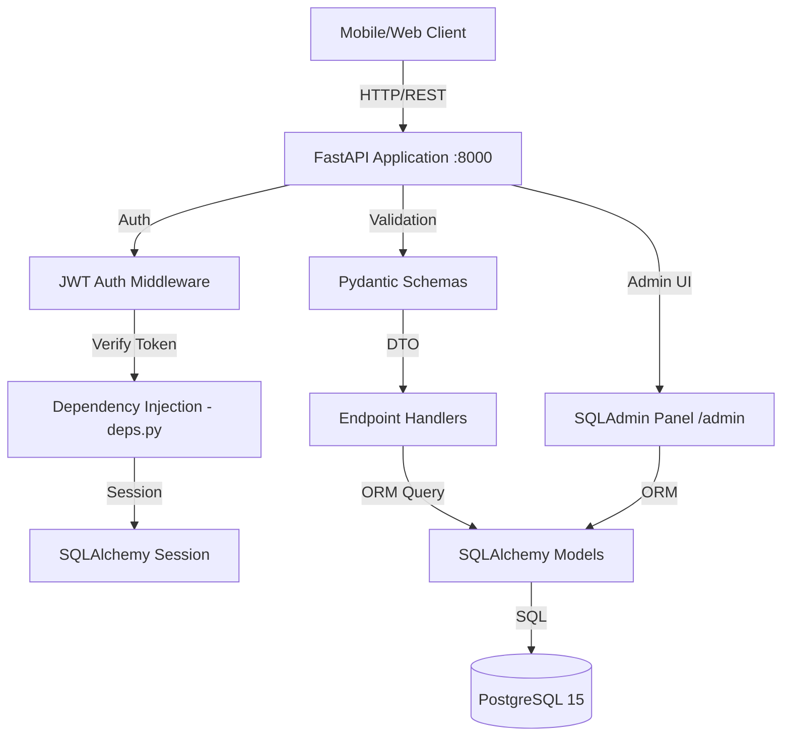
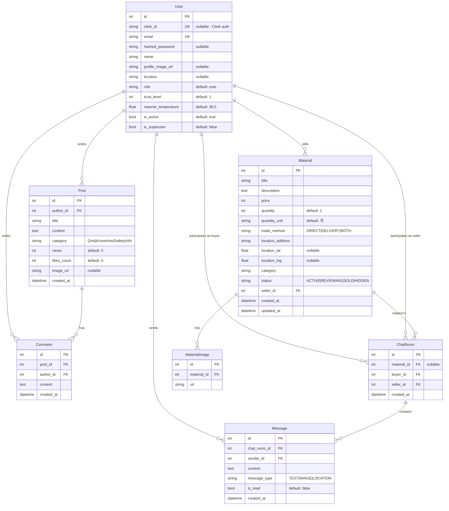
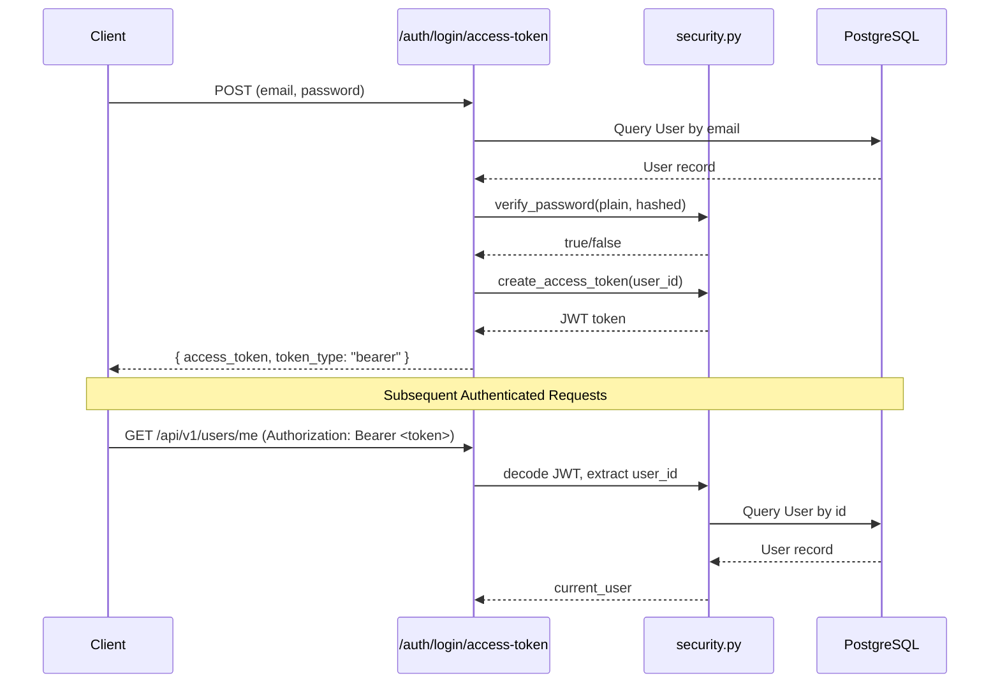

# Surplus Hub API - System Architecture

## 1. System Architecture

FastAPI 기반의 레이어드 아키텍처를 따릅니다.



### Request Flow

```
Client Request
  → CORS Middleware
    → FastAPI Router (/api/v1/*)
      → Pydantic Schema Validation (Request Body)
        → Dependency Injection (get_db, get_current_user)
          → Endpoint Handler (비즈니스 로직)
            → SQLAlchemy ORM Query
              → PostgreSQL
            ← ORM Result
          ← Pydantic Schema Serialization (Response)
        ← StandardResponse { status, data, meta }
      ← JSON Response
```

## 2. Database Schema (ER Diagram)



## 3. Module Architecture

```text
app/
├── core/           → 공통 모듈 (설정, 보안, 웹소켓, 푸시, 스토리지, Rate Limit 등)
├── db/             → 데이터베이스 연결 및 세션 관리
├── models/         → SQLAlchemy ORM 모델 (DB 테이블 매핑)
├── schemas/        → Pydantic DTO (요청/응답 직렬화 및 검증)
├── api/
│   ├── deps.py     → FastAPI 의존성 주입 (DB 세션, 인증 정보)
│   └── endpoints/  → 도메인별 HTTP 라우터 핸들러
├── crud/           → 재사용 가능한 DB 조작 함수 (도메인별 CRUD 인터페이스)
└── tests/          → pytest 기반 테스트 (API, Health, DB)
```

### Layer Responsibilities

| Layer | 파일 위치 | 역할 |
|-------|-----------|------|
| **Presentation** | `api/endpoints/` | HTTP 요청 처리, 라우팅, 응답 포맷팅 |
| **Validation** | `schemas/` | 요청 데이터 검증, 응답 직렬화 (camelCase alias 지원) |
| **Business Logic** | `api/endpoints/` | 비즈니스 규칙 (현재 엔드포인트 내 인라인) |
| **Data Access** | `models/`, `db/` | ORM 모델, DB 세션, 쿼리 실행 |
| **Security** | `core/security.py`, `api/deps.py` | JWT 토큰 생성/검증, 비밀번호 해싱, 권한 체크 |
| **Configuration** | `core/config.py` | 환경 변수, 앱 설정 (pydantic-settings) |

## 4. Authentication Flow



## 5. Key Technologies

| 기술 | 용도 | 버전 |
|------|------|------|
| **FastAPI** | 웹 프레임워크 (async 지원) | >=0.100.0 |
| **Uvicorn** | ASGI 서버 | >=0.23.0 |
| **PostgreSQL** | 관계형 데이터베이스 | 15 |
| **SQLAlchemy** | ORM (모델 정의, 쿼리) | >=1.4.0 |
| **Alembic** | DB 마이그레이션 | >=1.11.0 |
| **Pydantic** | 데이터 검증/직렬화 | >=2.0.0 |
| **passlib[bcrypt]** | 비밀번호 해싱 | >=1.7.4 |
| **PyJWT** | JWT 토큰 검증 | >=2.8.0 |
| **SQLAdmin** | Admin 패널 UI | >=0.16.0 |
| **databases** | Async DB 클라이언트 | >=0.8.0 |
| **asyncpg** | PostgreSQL async 드라이버 | >=0.28.0 |
| **Docker** | 컨테이너 배포 | - |
| **slowapi** | Rate Limiting | >=0.1.9 |
| **boto3** | AWS S3 연동 | >=1.28.0 |
| **firebase-admin**| Push 알림 | >=6.0.0 |

## 6. Response Format

모든 API 응답은 `StandardResponse` 래퍼를 사용합니다:

```json
{
  "status": "success",
  "data": { ... },
  "meta": {
    "totalCount": 100,
    "page": 1,
    "limit": 20,
    "hasNextPage": true,
    "totalPages": 5
  }
}
```

- `status`: `"success"` 고정
- `data`: 단일 객체 또는 배열
- `meta`: 페이지네이션 정보 (목록 API에서만 포함)

---

*Last Updated: 2026-02-20*
